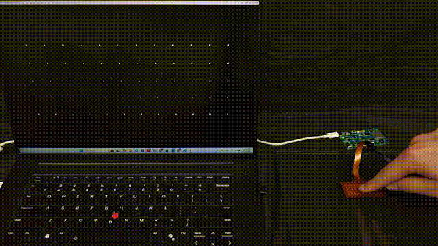

# Hardware & Assembly Instructions

This folder contains DexSkin hardware assets for fabricating the sensor, ordering the PCBs, and reproducing the calibration setup described in the paper.

## Release Status

Currently available in this folder:

- Finger electrode SVG layout
- Flexible PCB manufacturing files for the sensor array interconnects
- Readout PCB Gerbers
- Calibration fixture STLs

In progress (target: mid-April 2026):

- Readout board BOM
- Calibration fabrication guide
- Assembly and ordering recommendations

## Folder Guide

### `finger/`

- `DexSkin_Electrode_design.svg`: Layout of top and bottom capacitive electrode layers for the finger design described in the paper
  - *For researchers interested in access to the stretchable cylindrical DexSkin form described in the paper or tactile arrays in other grid formats, please contact Baiyu Shi at the Bao Group (`baiyushi@stanford.edu`) regarding sample availability.*

### `fpcb/`

- `dexskin_5pin_row_interconnection.zip` and `dexskin_12pin_column_interconnection.zip`: Gerber-ready flexible PCB files for the polyimide sensor array interconnects. Produces:
  - 5 x 12 taxel layout, mountable on flat or cylindrical grippers
  - 2.5 mm x 2.5 mm square taxels 
  - 1.5 mm spacing between neighboring taxels

  Gerber layers included in the PCB fabrication files:
  
  - **Mechanical Layer 1**: PCB outline
  - **Top Overlay**: top EMI shielding film outline
  - **Bottom Overlay**: bottom stiffener outline

### `readout_pcb/`

- `dexskin_readout_pcb_v1.1.zip`: Manufacturing files for the 4-layer readout board used to read both finger arrays simultaneously, prepared as a fabrication-ready Gerber archive

### `calibration/`

- `Final_Mold_Top.stl` 
- `Final_Mold_Bot.stl` 
- `Final_Mold_Supporting_Platform.stl` 
- `D20.8_Inner_Sleeve_TOP.stl`
- `D20.8_Inner_Sleeve_BOT.stl`
    - 3D-printable parts used to mold the Ecoflex and build airtight chambers for the 3-minute transfer calibration procedure described in the paper.

## Assembly Guide
Assembly overview:

For a full walkthrough, please see the [assembly video](https://dex-skin.github.io/open_source.html#assembly-guide) on our project website!

**Materials**
- Two fabricated fPCB pieces
- Thin double-sided tape
- Nonconductive dielectric layer
- Sharp scalpel for trimming dielectric and tape
  
In our builds, we use a sandpaper-structured midlayer as the dielectric.

**Procedure**
1. **Prepare base layer**:
   
     Apply double-sided tape along the boundary of one fPCB piece.
2. **Attach dielectric**:

     Laminate the dielectric layer onto the second fPCB piece, trimming as needed.
3. **Align electrodes**:

     Carefully align the top and bottom electrode layers by matching the exposed copper taxels.
4. **Bond Assembly**:

     Press around the edges to ensure the double-sided tape bonds the two pieces together securely.

   
After assembly, verify the sensor by following the firmware instructions provided in [`../firmware/README.md`](../firmware/README.md). Then, run:
- [`../firmware/scripts/readout.py`](../firmware/scripts/readout.py)
- [`../firmware/scripts/visualize.py`](../firmware/scripts/visualize.py)

to verify that the sensor reads out correctly and view the real-time visualization

## Manufacturing Notes

- The ZIP archives in `fpcb/` and `readout_pcb/` are intended for direct submission to a PCB manufacturer.
- If your manufacturer asks for layer clarification on the flexible PCB files, you may use the layer notes above.

## Planned Additions

- Readout PCB BOM, including alternative parts where distributor availability changes
- Calibration fixture build notes
- Step-by-step assembly guidance

Last updated: March 26, 2026
